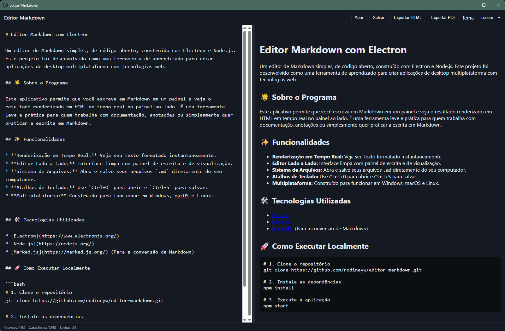

# Editor Markdown com Electron

Um editor de Markdown simples, de código aberto, construído com Electron e Node.js. Este projeto foi desenvolvido como uma ferramenta de aprendizado para criar aplicações de desktop multiplataforma com tecnologias web.

## 🌟 Sobre o Programa

Este aplicativo permite que você escreva em Markdown em um painel e veja o resultado renderizado em HTML em tempo real no painel ao lado. É uma ferramenta leve e prática para quem trabalha com documentação, anotações ou simplesmente quer praticar a escrita em Markdown.

## ✨ Funcionalidades

* **Renderização em Tempo Real:** Veja seu texto formatado instantaneamente.
* **Editor Lado a Lado:** Interface limpa com painel de escrita e de visualização.
* **Sistema de Arquivos:** Abra e salve seus arquivos `.md` diretamente do seu computador.
* **Atalhos de Teclado:** Use `Ctrl+O` para abrir e `Ctrl+S` para salvar.
* **Multiplataforma:** Construído para funcionar em Windows, macOS e Linux.

## 📸 Screenshot



## 🛠️ Tecnologias Utilizadas

* [Electron](https://www.electronjs.org/)
* [Node.js](https://nodejs.org/)
* [Marked.js](https://marked.js.org/) (Para a conversão de Markdown)

## 🚀 Como Executar Localmente

```bash
# 1. Clone o repositório
git clone https://github.com/rodineyw/editor-markdown.git

# 2. Instale as dependências
npm install

# 3. Execute a aplicação
npm start